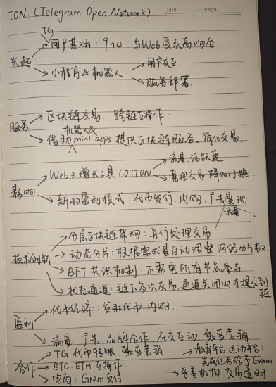

#### TON

#### DEX

1. DEX是什么？

​	DEX，全称去中心化交易所（Decentralized Exchange），是一种基于区块链技术的交易平台，它允许用户直接进行加密货币或其他数字资产的交易，而无需依赖任何中心化的权威机构。DEX通过**智能合约自动执行交易**，实现了交易过程的去中心化和自动化。

2. DEX和CEX比较

​	**去中心化：**DEX无中心化实体控制交易，用户拥有对资产的完全控制。CEX由中心化实体控制，用户必须信任交易所保管资产。

​	**安全性：**DEX不易受到单点故障，但需要用户对自己的私钥负责。CEX易受到攻击而造成资产损失。

​	**流动性：**DEX流动性来自流动性提供者(LPs)，通过提供资产加入流动性池来赚取交易费。流动性小且分散。CEX流动性强。

​	**法定货币支持性：**DEX一般不支持法定货币交易。CEX支持法定货币，且支持购买加密货币。

​	**交易费用：**DEX无中心化机构，交易费用更低。

​	**监管：**DEX受较少监管，同时可能带来合规性问题，如洗钱和诈骗。

​	**门槛：**DEX门槛更高，界面不直观，需要用户自己管理钱包，需要理解智能合约

3. 技术侧

   **区块链**

   **智能合约**

   **流动性池** 一种智能合约，由LPs提供资产，为交易提供流动性，使得用户能够在没有订单簿的情况下进行交易。

   **自动做市商AMM机制** 自动匹配买卖订单的算法，通过流动性池自动执行交易。基于恒定乘积公式*x*×*y*=*k*， *x* 和 *y* 分别代表两种资产的数量，*k* 是一个常数。由于交易直接影响池中资产的比例，资产的价格会根据交易量和方向自动调整，使得AMM能够在没有订单簿的情况下自动执行交易。

​	**聚合器** 整合多个DEX，方便用户使用和选取最佳利润的DEX。

4. AMM与订单簿机制的比较：

​	**交易方式**：AMM：用户直接与流动性池进行交易，无需等待市场上的其他参与者。订单簿：用户提交买卖订单，等待市场上的其他参与者匹配这些订单。

​	**流动性提供**：AMM：流动性由流动性提供者通过向池中存入资产来提供。订单簿：流动性由市场上的买卖双方提供，他们通过提交限价订单来提供流动性。

​	**价格发现**：AMM：价格由资产在流动性池中的比例决定，交易本身会调整价格。订单簿：价格由市场上的买卖订单决定，通过订单匹配来发现价格。

​	**滑点和效率**：AMM：由于没有订单簿，大额交易可能导致较大的价格滑点，因为流动性池中的资产数量可能不足以满足大额订单。订单簿：滑点通常较小，因为订单簿上有大量的订单可以匹配，从而提供了更好的价格连续性和深度。

​	**资本效率**：AMM：资本效率较低，因为流动性池中的资产需要保持一定的比例，这可能导致资金闲置。订单簿：资本效率较高，因为做市商可以根据市场情况调整他们的报价，从而更有效地使用资本。

​	**抗操纵性**：AMM：由于没有订单簿，AMM对某些类型的市场操纵（如抢先交易）的抵抗力较弱。订单簿：订单簿交易所通常有更复杂的监控系统来检测和防止市场操纵。

5. 发展方向

​	继承更多金融服务，如聚合器，钱包，以及其他DeFi协议

​	跨链交易，支持不同区块链的资产交换

​	改进用户体验，包括优化界面，提高交易速度

​	妥善解决合规问题，包括反洗钱和KYC