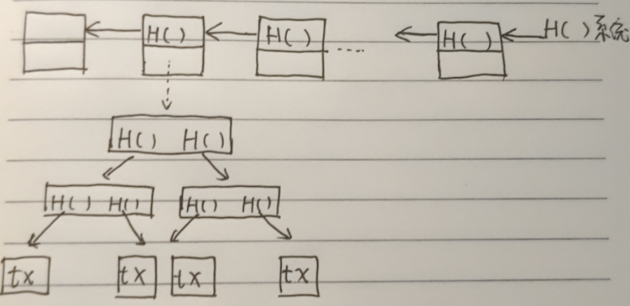

1. 比特币选取的哈希函数：**SHA-256** 

   特点：

   1. collision resistance：不能人为制造哈希冲突，保证当内容被篡改时，哈希值一定发生变化

   2. hiding：加密过程是单向的，不能破解
   3. puzzle friendly：不能通过哈希值来推断原始输入的任何性质，必须全部枚举求解

2. 签名方法：非对称加密。发送方将原始消息进行哈希处理，并使用私钥加密。将原始消息和加密消息发送给接收方。接收方使用发送方的公钥解密，并且将解密后的消息与经过哈希处理的原始消息进行对比，如果相同则说明签名合法且内容没有被篡改。

3. 区块链结构：

​	**逻辑结构：**一条最长合法区块链包含多个区块，每个区块包含区块头和区块体。区块头包含比特币版本，前一个区块的区块头的哈希指针，Merkle Root哈希指针，target，nonce；区块体包含交易记录(Merkle Tree)。

​	**物理结构：**区块链由全节点和轻节点服务器存储。全节点负责存储整个区块链的副本，轻节点只存储每个区块的区块头。

​	**数据结构：**任何一条交易记录的篡改，都会最终导致系统中存储的哈希指针发生变化。H()代表哈希指针，包括前一个区块的地址和前一个区块头的哈希值。

4. 比特币交易程序：

​	输入：指向资金来源的交易的输出

​	输出：收款人公钥 & 交易金额 (UTXO)

​	签名：转账者的签名

​	举例：C账户已有来自A和B的2 btc和3 btc，C再向D转账2.5 btc

​		转账前，C账户信息：

​			UTXO_A: 2 未消费

​			UTXO_B: 3 未消费

​		转账时，输入为：UTXO_B，输出为D：2.5，C：0.5(找零给自己)

​		转账后，C账户信息：

​			UTXO_A: 2 未消费

​			UTXO_C: 0.5 未消费

​			UTXO_B: 3 已消费

5. 比特币共识机制：**工作量证明PoW**

​	将未被记录到区块链的合法交易记录进行打包，并生成新的区块，广播到所有节点，从而在所有节点中添加新区块。求解满足要求的新区块的哈希值的过程称为挖矿，求解要求：找到一个随机数nonce，使得前一个区块的区块头加上nonce，通过哈希处理获得一个满足难度要求的哈希值。最先完成求解的矿工可以将区块添加到节点的最长合法链中，并广播到所有节点。

​	为什么增加难度设置：对求解结果的哈希值增加难度要求，从而控制新区块的生成频率，并增加攻击者的攻击难度。

6. 新闻阅读

​	[为什么说 Ethena 是真正的大机会？](https://foresightnews.pro/article/detail/69527)

​	[美 SEC 再次推迟对以太坊现货 ETF 期权的决定](https://foresightnews.pro/news/detail/55468)